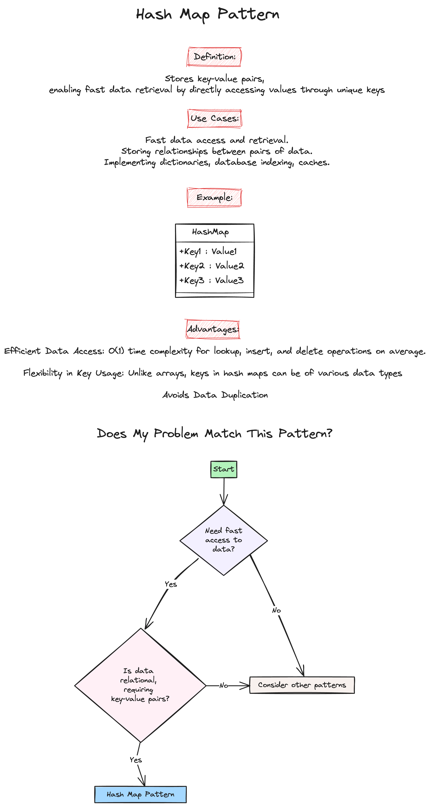

# Week 1: Lists, Arrays, Sorting

## Practice Problems

### 1. Valid Palindrome [(Leetcode 125)](https://leetcode.com/problems/valid-palindrome/description/)

-   [My Solution]

### 2. Subdomain Visit Count [(Leetcode 811)](https://leetcode.com/problems/subdomain-visit-count/description/)

-   [My Solution]

### 3. Two Sum [(Leetcode 1)](https://leetcode.com/problems/two-sum/description/)

-   [My Solution]

### 4. Longest Substring without repeating characters [(Leetcode 3)](https://leetcode.com/problems/longest-substring-without-repeating-characters/description/)

-   [My Solution]

### 5. Group Anagrams [(Leetcode 5)](https://leetcode.com/problems/group-anagrams/description/)

-   [My Solution]

## HW Problems

### 1. String to Integer (atoi) [(Leetcode 8)](https://leetcode.com/problems/string-to-integer-atoi/description/)

-   [My Solution]

### 2. Find All Anagrams in a String [(Leetcode 438)](https://leetcode.com/problems/find-all-anagrams-in-a-string/description/)

-   [My Solution]

### 3. Reverse Words in a String [(Leetcode 151)](https://leetcode.com/problems/reverse-words-in-a-string/description/)

-   [My Solution]

## Study Notes

### Problem Solving Patterns

-   **Hash Map**

    

    Source: https://github.com/Kumuda123/NYU-Tandon-LeetCode-Bootcamp-Fall-2024/tree/main/Week%202%3A%20Strings%20%26%20HashMap

## Helpful Resources

-   [Exercism: Strings](https://exercism.org/tracks/python/concepts/strings)
-   [Python.org: String Methods](https://docs.python.org/3/library/stdtypes.html#string-methods)
-   [Exercism: Sets](https://exercism.org/tracks/python/concepts/sets)
-   [Exercism: Dicts](https://exercism.org/tracks/python/concepts/dicts)
-   [Exercism: Dicts Methods](https://exercism.org/tracks/python/concepts/dict-methods)
-   [Python.org: Mapping Types](https://docs.python.org/3/library/stdtypes.html#mapping-types-dict)
-   [Python.org: Dictionaries](https://docs.python.org/3/tutorial/datastructures.html#dictionaries)
