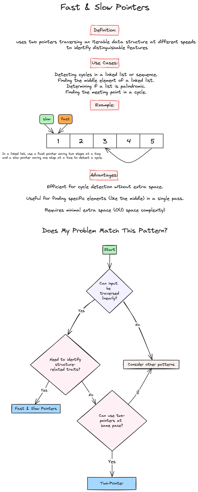

# Week 3: Linked Lists & Matrices

## Practice Problems

### 1. Middle of Linked List [(Leetcode 876)](https://leetcode.com/problems/middle-of-the-linked-list/description/)

-   [My Solution]

### 2. Reverse Linked List [(Leetcode 206)](https://leetcode.com/problems/reverse-linked-list/description/)

-   [My Solution]

### 3. Reorder List [(Leetcode 143)](https://leetcode.com/problems/reorder-list/description/)

-   [My Solution]

### 4. Valid Sudoku [(Leetcode 36)](https://leetcode.com/problems/valid-sudoku/description/)

-   [My Solution]

### 5. Rotate Image [(Leetcode 48)](https://leetcode.com/problems/rotate-image/description/)

-   [My Solution]

## HW Problems

### 1. Palindrome Linked List [(Leetcode 234)](https://leetcode.com/problems/palindrome-linked-list/description/)

-   [My Solution](https://github.com/ahhyun-moon/nyu-leetcode-bootcamp/blob/main/Week3/leetcode_234.py)

### 2. Remove Nth Node From End of List [(Leetcode 19)](https://leetcode.com/problems/remove-nth-node-from-end-of-list/)

-   [My Solution](https://github.com/ahhyun-moon/nyu-leetcode-bootcamp/blob/main/Week3/leetcode_19.py)

### 3. Set Matrix Zeroes [(Leetcode 73)](https://leetcode.com/problems/set-matrix-zeroes/description/)

-   [My Solution]

## Study Notes

### Problem Solving Patterns

-   **Fast and Slow Pointers**

    

-   **In-place Reversal of a Linked List**

    

-   **Matrices**

    

    Source: https://github.com/Kumuda123/NYU-Tandon-LeetCode-Bootcamp-Fall-2024/tree/main/Week%202%3A%20Strings%20%26%20HashMap

## Helpful Resources

-   [Programiz: Linked List](https://www.programiz.com/dsa/linked-list)
-   [Datacamp: Linked List](https://www.datacamp.com/tutorial/python-linked-lists)
-   [Programiz: Matrix](https://www.programiz.com/python-programming/matrix)
-   [Python.org: List Data Structure](https://docs.python.org/3/tutorial/datastructures.html)
