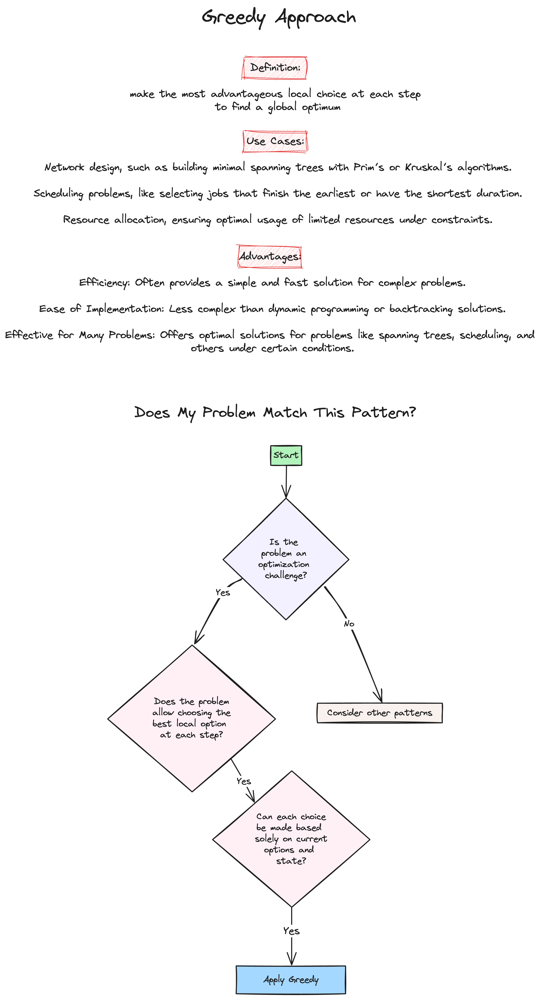
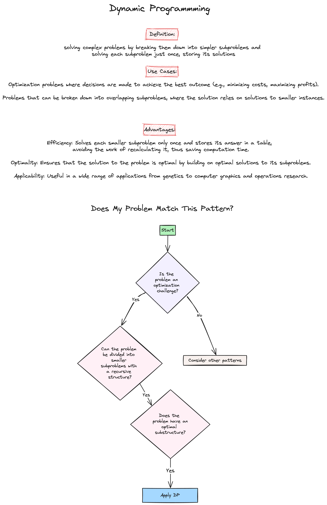
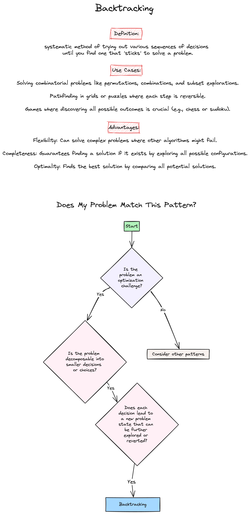

# Week 8: Dynamic Programming & Greedy Algorithms

## Study Notes

### Problem Solving Patterns

-   **Greedy Algorithm**

    

-   **Dynamic Programming**

    

-   **Backtracking**

    

## Practice Problems

## HW Problems

### 1. Partition equal subset sum [(Leetcode 416)](https://leetcode.com/problems/partition-equal-subset-sum/)

-   [My Solution](https://github.com/ahhyun-moon/nyu-leetcode-bootcamp/blob/main/Week8/leetcode_416.py)

### 2. Coin Change [(Leetcode 322)](https://leetcode.com/problems/coin-change/)

-   [My Solution](https://github.com/ahhyun-moon/nyu-leetcode-bootcamp/blob/main/Week8/leetcode_322.py)

### 3. Maximum Subarray [(Leetcode 53)](https://leetcode.com/problems/maximum-subarray)

-   [My Solution](https://github.com/ahhyun-moon/nyu-leetcode-bootcamp/blob/main/Week8/leetcode_53.py)

## Helpful Resources

-   [Programiz: Greedy Algorithm](https://www.programiz.com/dsa/greedy-algorithm)
-   [Programiz: Dynamic Programming](https://www.programiz.com/dsa/dynamic-programming)
-   [Programiz: Backtracking](https://www.programiz.com/dsa/backtracking-algorithm)
